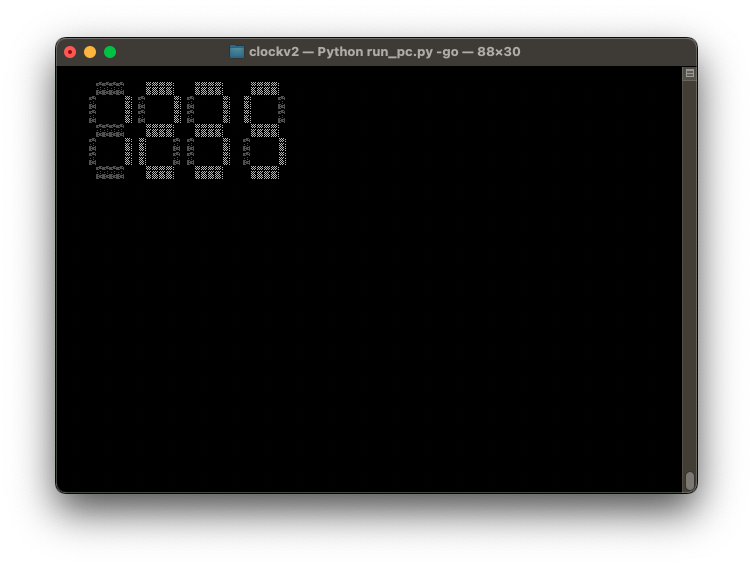

# Setting up your development environment

Wow, you're dumb enough to write code for this shit? Well okay then.

First, a disclaimer: **Don't expect this documentation to be up to date.** A professional software developer knows
that the best documentation is no documentation at all because that forces others to read through your code to understand
it, instead of lightening the cognitive load on new developers so that they can get started as quickly as possible.

So, without further ado, let's get started!

## The private/ directory

Create this directory and put mpy-cross in there. .gitignore is setup to ignore this directory so go nuts with
whatever you want to put in there.

## Building for hardware

**.mpy files are MANDATORY when running on real hardware**. Since the move to ESP32-based hardware,
it's become very obvious that the TMUCITW software is pushing Micropython very hard to the point where
there's next to no memory and CPU time available.

To get your software running:

1. Put mpy-cross in private/
2. Run `make` (builds .mpy files and puts common stuff in bin/)
3. Upload contents of bin/ to the root of your device
4. Put appropriate bootstrap files in bootstrap/ to the root of your device

## The mock environment

The TMUCITW software has the ability to run on your machine (using python3) for testing and quick development.
Due to how development has progressed, it's no longer possible to run it easily.
Details to follow when I care, but for now, the trick is to put together a directory structured like how bin/
is, but with raw .py files. Then do `python3 run_pc.py` to run the simulator.
