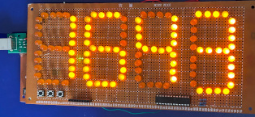
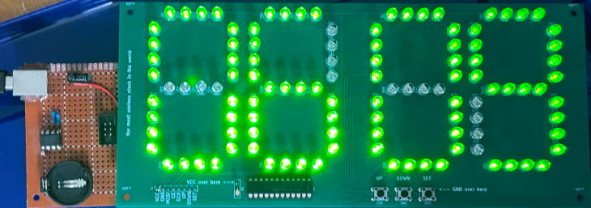
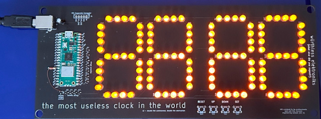
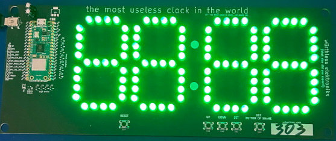
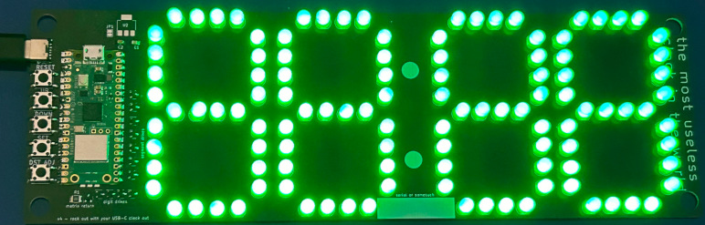
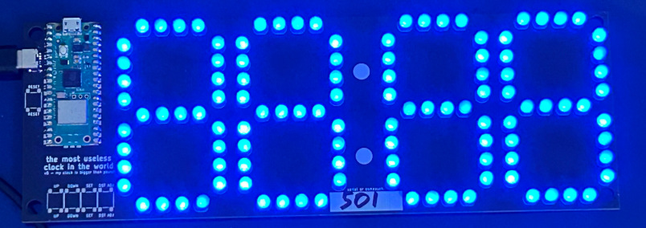

# Hardware revision history

This section only applies to those who have a würthless elektroniks-branded TMUCITW. If you're just checking out the code for your own use, you can at least appreciate the pretty pictures.

**Note that I'm not just putting these pictures here to jerk myself off!** They're here for an important reason: so you know which hardware revision you ended up with, and known issues with that revision in case you have trouble.

### The ATMega Generation

#### The original prototype

It's nice to look at.

#### Version 1

**Version 1** is something I don't support anymore. It ran on ATMega328-based hardware with a MAX7219 driving the display and a DS1307 for RTC. As you can tell, that's extremely expensive and was a motivator for remaking the clock on much cheaper hardware. Much of the documentation below should apply to how it behaves. In case you give a shit, only three of these exist in the wild, although there could possibly be more if someone dumb enough to do so builds more of them using [the publicly available Gerbers and sourcecode](https://github.com/wurthless-elektroniks/clock_v1).

**This version is known to have numerous issues**, mostly due to the use of the MAX7219 and DS1307 chips and the separate board design. The clock will freeze and glitch out if you touch it the wrong way. The DS1307 also needs a pulldown resistor in order to function at all when a battery is not connected. In non-technical parlance this means the coin cell you put in the battery holder will die in a few months when it should last years. When the battery dies, the clock will no longer reliably keep track of time until the battery is replaced.

### The Raspberry Pi Pico W Generation

**WARNING!** Versions 2, 3 and 4 are all subject to an issue where it is possible to backfeed power to another device. Version 5 has a diode in place to mitigate this issue. Do **NOT** plug any USB cable into the Micro USB port! It's there for debugging purposes only. 

#### Version 2

**Version 2** (*double the uselessness, double the destruction*) is the first RP2040-based version, now using the standard stylish black solder mask. **This board will typically come with bodges applied; while it's ugly, it's necessary for the clock to function at all.** Originally, DST and the master PWM transistor would be controlled entirely in software, but this was decided against because it would add code complexity and would not be safe or reliable (that master output control transistor has gone up in smoke on me several times during testing). The DST button, if present, will be glued onto the board next to the SET button. It is not pictured in this photo for whatever reason (i.e., I was lazy).

#### Version 3

**Version 3** (*for those about to clock... we salute you*) fixes the issues with v2, changes to a mini-USB port for power and has a bigger expansion port. It also has space for a TLV-1117-33 voltage regulator, but it is not populated as the Pico's built-in 3v3 voltage regulator works nicely enough. [Grab the Gerbers here.](/gerbs/clock_v3/)

#### Version 4

**Version 4** (*rock out with your USB-C clock out*) is a major revision to the board to make it smaller (and cheaper). The expansion port has been removed, and the pushbuttons are now surface mount. But, obviously, the biggest change is the switch to USB-C power, which was done because absolutely uses mini-USB for power applications. It's either that, or force the end users to use the awful, horrible, no-good piece of crap power interface that is Micro USB. **There are no known issues with this board (yet).**

#### Version 5

**Version 5** (*my clock is bigger than yours!*) is the final version to run on the Raspberry Pi Pico W. The LED matrix driver circuit is redone; the matrix is now driven by 5 volts and a BCR420UW6 is used for the master PWM output control. The clock is now able to be used with blue and purple LEDs, which wasn't possible on the older designs (although probably possible with the MAX7219). Thanks to more efficient space management on the board (and the spaghetti wire routing to go with it), the board size has also been slimmed down a bit more, at the cost of my sanity, because now there are tiny, impossible-to-solder dual NPN transistors switching the matrix. [Grab the Gerbers here.](/gerbs/clock_v5_whitelabel/)

### The ESP32 Generation

Seeing as the Raspberry Pi Pico W was way too expensive for large production runs, the decision was made to convert the clock to an ESP32-based design, and this brought on a lot of headaches, curse words, and wasted money.

**Version 6** (*boom boom boom, I want you in my WROOM*) was the first ESP32-based version of TMUICW and it was an abject failure. Too many hardware bugs made it impossible to use, so it was quickly followed by **Version 7** (*ESP32 Ra.De.*) which still had more bugs but was at least enough to test the software on.

**Version 8** (*The Ocho*) is the first production-ready version and will most likely be the last version I work on for a while. There are three minor revisions. v8 has a capacitor bodged on to the reset line because without it, the ESP32 will crash the second Wi-Fi is turned on. v8b corrects this issue. v8c changes the USB-C connector to be fully surface mount in an attempt to keep the connector from snapping off the board when too much force is applied, a problem that all of the USB-C clocks (and v3) have had this whole time.

While the ESP32 clocks are cheap to produce (roughly $10 USD a board without the LEDs being populated) the downside is that there is no longer a PIO coprocessor driving the LED matrix, so all that has to be done in software. Getting the timings wrong causes the display to flicker, and under Micropython, you can't eliminate flicker 100%. However, I have tried to reduce flicker as best I can.

### The future

There really isn't much room for improvement now.

Possible areas for improvement:
* Complete rewrite of the software in C (not really worth it at this point)
* Change ESP32 to an ESP32C3 and a shift register to assist with driving the display (saves maybe $0.50-$1.00)
* Better LED matrix driver to allow for smarter display scanning
