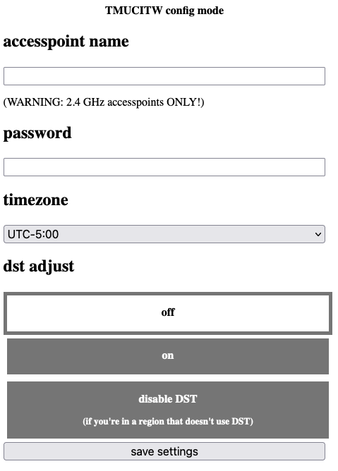

# The Most Useless Clock in the World: The User Manual

Congratulations! You were dumb or unlucky enough to buy, acquire, or otherwise use The Most Useless Clock in the World. You now have a janky, overpriced and unreliable clock that doesn't do much other than tell the time. But it does look stylish when viewed across a room.

**If you're an end-user, this documentation is for you.** If you're just someone who wants to use this code as part of their own project (*who would?*), then it will still be useful in a way. However, most of the technical docs, if any, will live in the sourcecode.

**If you're a developer**, [read this](development.md).

## Revision history

[Read this](history.md) for details on each hardware revision and known issues with them.

## Initial Setup

### For Wi-Fi-enabled clocks:

**IF YOUR CLOCK HAS WI-FI SUPPORT**, the first thing that should be displayed is the letters "CFG". This means that the clock is starting up in configuration mode. Using a Wi-Fi compatible device, connect to the network labelled TMUCITW (or similar). If prompted for a network password, enter "wurthless" (no quotes!).

Once connected to the network, open your web browser to: http://192.168.4.1

If successful, you'll see a page like this:

Here's what to enter:

* "wifi accesspoint": The name of your Wi-Fi network. As the page notes, this needs to be a 2.4 GHz Wi-Fi network, as 5 GHz networks are not supported. When in doubt, check your router settings.
* "wifi password": The password for the given network. **This is required**. If your Wi-Fi network is not password protected, you're a bozo.
* "timezone": Your timezone as a UTC offset. **In regions that obey Daylight Savings Time, this is the UTC offset when DST is not in effect.**
* "dst adjust": Whether to adjust for DST. If set to "off", DST will be turned off. If set to "on", DST will be turned on. **In regions that do not observe Daylight Savings Time, you should set this to "disable dst".**

Press "save settings" to generate the bug report you will be submitting to me when it inevitably crashes. But if it doesn't crash, then congratulations, your clock is now set up. Press RESET on your clock, and it should connect to the Internet, grab the current time, and display it. Hooray!

**If you need to re-enter this panel for any reason, such as to re-configure your Wi-Fi settings, hold SET when powering up the clock (or pressing RESET).**

### Manual configuration mode:

The Most Useless Clock in the World provides a manual configuration mode in the event that it is unable to synchronized to an external timesource.

If your clock boots to a message that says "Err", it was not able to synchronize to a time source, either because the Wi-Fi network is down, or the connection to the time server failed. Unfortunately, this is just what happens because the NTP servers rate-limit their clients. Wait a few seconds and press RESET. If it still won't connect to the network, hold SET until the display clears, then release SET. You'll be in manual configuration mode.

If your clock doesn't have any time sources to read from, and the clock is not already set (or loses its configuration because the battery dies), it will boot straight to manual configuration mode.

In manual configuration mode, the clock typically prompts for inputs in the following order: **year, month, day, hour, minute**. Press UP or DOWN to change settings, and press SET to confirm and move on to the next one. If you mess something up, don't fret, you can always enter configuration mode again once the clock is set.

**If the Daylight Savings Time feature is not disabled,** the last setting in manual configuration mode will be DST. The clock will display "DST ON" or "DST OFF". Press UP/DOWN to toggle the setting. This setting should reflect whether Daylight Savings Time is effect in your region or not. Press SET to confirm the setting.

## Normal operation state

The clock displays the current time. Duh!

However, the pushbuttons on the front will still be active. Here's what they do.

* Pressing **UP** will change the brightness setting. It will decrease with each push until it reaches its minimum setting, after which it resets to the highest brightness.
* Pressing **DOWN** will toggle between the current time, year, month, and day. After a while, the clock resets to displaying the current time.
* Holding **SET** will reconfigure the current time. If the clock is configured to synchronize time (e.g., over Wi-Fi), it will do so. In all other situations, this will send the clock back to manual configuration mode.
* Holding **DST**, **if the Daylight Savings Time feature is not disabled,** will toggle DST. 
* Pressing **REBOOT** (**RESET** on older revisions) at any time will force the clock to reboot.

## Daylight Savings Time

**To toggle DST, hold the DST button for five seconds when the clock is running.**

The Most Useless Clock in the World does *NOT* automatically adjust for Daylight Savings Time. It never has, it never will. DST is annoying to implement thanks to the many rules that vary between countries and are subject to change.

To implement DST, the following changes would need to be made:

* Implement all DST rules listed [here](https://en.wikipedia.org/wiki/Daylight_saving_time_by_country)
* Automatic software updates to account for future rule changes
* Implement DST rule selection

This is as opposed to the other solution:

* Add pushbutton to toggle DST
* Force user to toggle DST manually

When in doubt, keep it simple.

## Quality Assurance Policy

At würthless elektroniks, we can assure you that the quality of our products is terrible. However, we try to keep our customers happy because otherwise we can't make money. If your clock dies a premature death, please get in contact with us. Once we take ten minutes to laugh at your misfortune, we'll be glad to offer a replacement or any assistance. If there's a serial number on your clock, please have it handy!

Remember: **with würthless elektroniks, dissatisfaction is guaranteed or your money back!** (*NOTE: We do not offer refunds.*)
