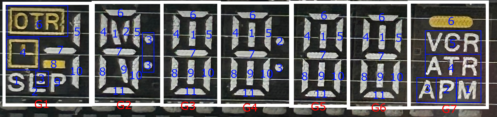

# Samsung SVV07SS06 VFD display

VFD display pulled from an old VCR.

## Pinout

The two pins on either side are for the heater voltage. 2.5 volts DC should be acceptable, but
I'm not sure of the actual voltage.

For the main pins, going from left to right, with the display facing you:
- Pins 1-11 are the segments (pin 1 = segment 1, pin 2 = segment 2, etc.)
- Pins 12/13 are unused
- Pins 14-20 are the grids (pin 14 = grid 1, pin 15 = grid 2, etc.)

Segment and grid voltage should be around 24 volts, as is typical for VFDs.

## Grid/segment map

