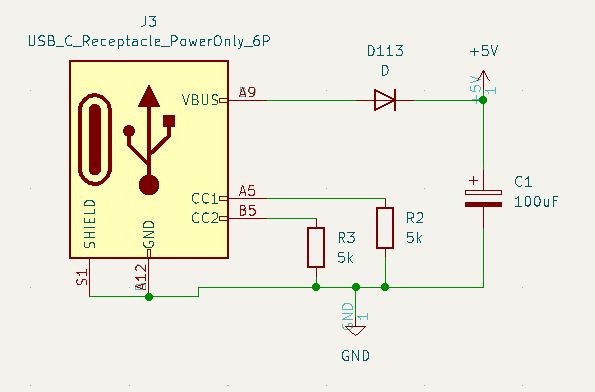
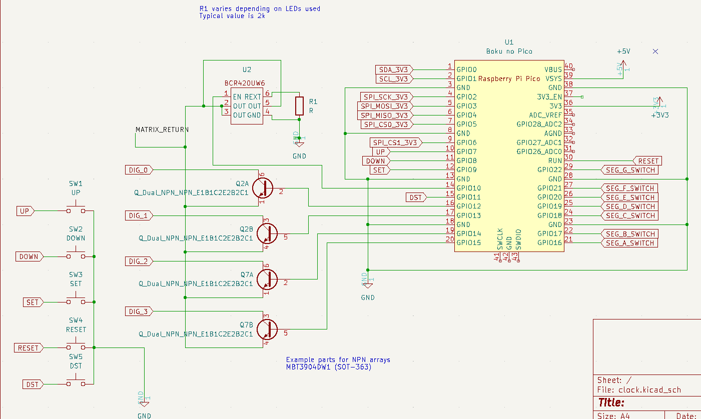
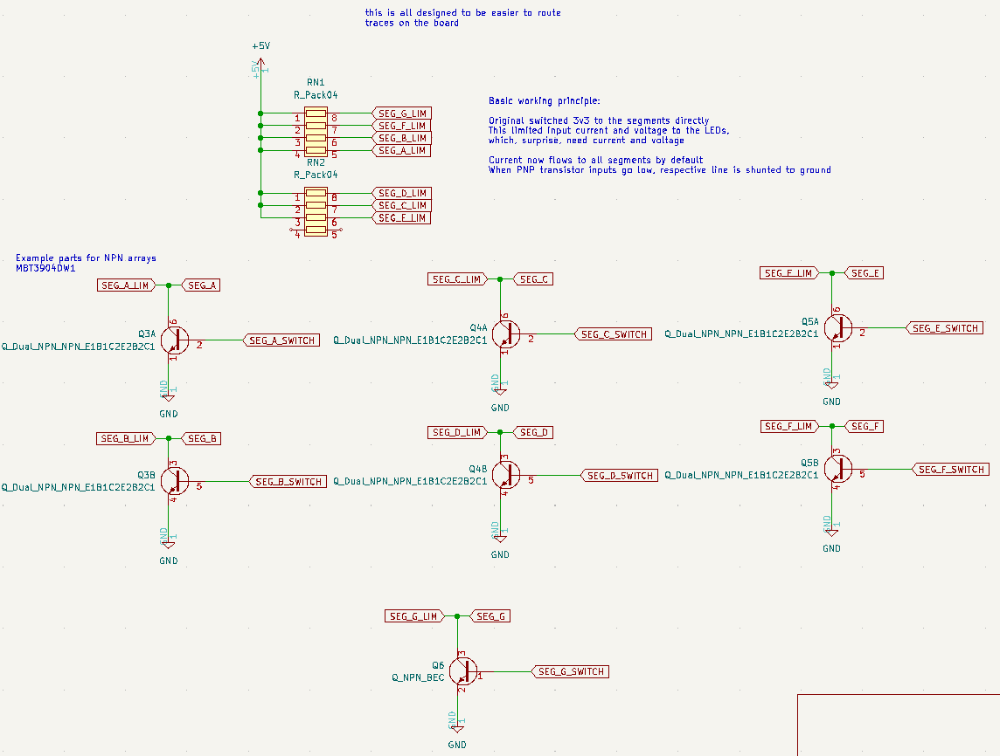
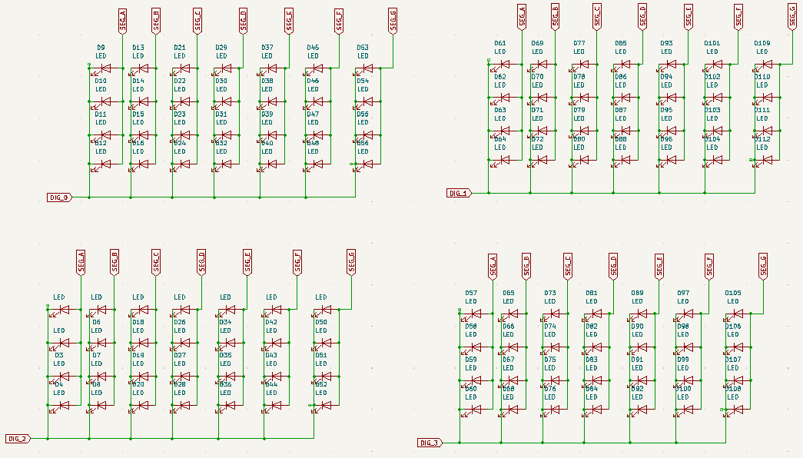

# The Most Useless Clock in the World (v5, white label)

Unbranded RPi Pico W-based clock for your clockey enjoyment. Production version still has to be tested. You get absolutely no support for these, and I won't bother correcting any hardware bugs that come with this release. The Pico era of TMUCITW is over. It's time to move on.

## Parts, BoM, what haves ya

* U1: Raspberry Pi Pico W, will also accomodate the Pico and Pico H
* U2: BCR420UW6 constant current device, SOT-26 footprint
* R1: Sense resistor for BCR420UW6 (value varies); 1210 footprint. If full current is needed, this should be a 0 ohm resistor.
* R2/R3: 5.1k pullup resistors to enable USB-C power, 0603 footprint
* Q1, Q2, Q3, Q4, Q5, Q7: Dual NPN transistors, E1/B1/C2 pinout, SOT-363 footprint
* Q6: NPN transistor, BEC pinout, SOT-23 footprint
* RN1, RN2: 470 ohm segment isolating/current limiting resistor network, 1206 footprint
* D113: 1206 input protection diode so idiots do not backfeed micro USB power to a USB-C host
* C1: 100 uF courtesy cap, 1206 footprint
* SW1, SW2, SW3, SW4, SW5: 6x6mm tactile switches
* And, most importantly, 112 LEDs, 5mm or 3mm both work

## Schematics

### Power circuit 

Really boring power input circuit. Resistors enable USB-C power, diode prevents backfeeding (to an extent), smoothing cap is there just to be nice.

### Main circuit

Nothing special over here. Pushbuttons get one I/O each, all are digital. Remnants of the expansion bus are shown in this diagram, but they are not present on the board itself.

GPIOs 16-22 drive the LED matrix on the switcher circuit. Digit returns (DIG_0-DIG_3) are switched through GPIOs 12-15. GPIO10 provides PWM for the display because it was far easier to implement in software. The BCR420UW6 can just as easily be replaced with a normal NPN transistor, but it will not drive the segments with consistent current, so you'll have one digit that is lighter than the others. I picked the BCR420UW6 at random, we'll see how it holds up.

### Switcher circuit

The 5 volt rail is sent through a resistor array. By default, current flows to the LED segments and is only allowed out when the Pico turns one of the digit drives on. To turn a segment off, the respective transistor for that segment is turned on, and that short-circuits the signal to ground, preventing the LEDs from lighting up. I could have used PNP transistors here but I didn't because I didn't feel like getting too fancy with my design.

### LED matrix

Also called "a good way to waste a few hours in KiCad". Which in practice is more than a few hours because KiCad keeps crashing.
