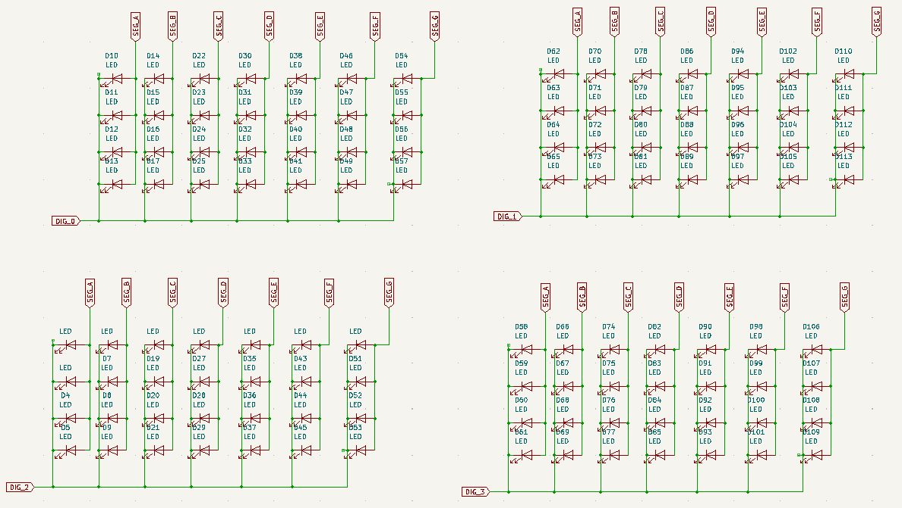

# The Most Useless Clock in the World (v8b, white label)

This is the first "successful" version of TMUICTW running on ESP32-based hardware. As usual, I've made a white label release
so anyone can produce these boards if they do so please.

This is also the first TMUCITW design meant to be assembled (at least in part) at the factory. If you want to assemble it
by hand, go ahead, but it will be a long and frustrating process in which you'll probably screw up big time.

**WARNING**: I haven't put these Gerbers into production yet, but I am confident this works based on initial tests.
This is actually v8b, v8 has only one known hardware bug that is corrected in these files.

## Bill of Materials

See clock-bom.csv.

The BOM and placement files are an exhaustive listing of components, including the programming header and all 112 LEDs.
They're only included for people who will be doing large orders of these things (lol as if). Unless you're willing to
eat the extra costs involved, leave them out of the order.

## Schematics

### Debug header

This circuit has a 5 pin JST connector needed for debugging and programming the ESP32 program.
It doesn't support USB data as that would cost more, and the ESP32 is already low on available I/O pins.

If I do more projects with the ESP32 I may as well reuse this pinout for the debug header. Just makes it more
convenient. You can build one easy with a switch, a pre-crimped JST cable, and a FTDI TTL232R in 3v3 mode.

### Power circuit 

The 5v power rail coming in off the USB-C connector is knocked down to 3.3v by a TLV1117-33 voltage regulator.
Two 5.1k resistors tell the USB-C power supply to give us some juice. As we will likely never need a full 3 amps
of power, a 750 mA PTC resettable fuse is in line with the 5v power source in a bid to shut down any fireworks
before they happen.

### Main circuit

This is the raw schematic straight out of Kicad. It needs to be cleaned up, but it is what it is, and
most of the circuit is fairly straightforward.

The weird upside-down capacitor at C2 on the reset line is absolutely necessary for the circuit to work.
If it isn't there, then the ESP32 will crash the second the Wi-Fi interface is turned on.

There is one major change from v5, and it's that the BCR420UW6 now has its current sense pin short circuited
to ground. The LED matrix is current limited on the segment inputs, so the chip won't be seeing more than
200 mA passing through it at a given time. I'm definitely abusing this chip in my design as it's meant to be
used in LED strings rather than in an application like this, but it works, and that's what matters.

### Switcher circuit

Functionally identical to v5.

The 5 volt rail is sent through a series of 220 ohm resistors, one per segment. By default, current flows to the LED segments and is only allowed out when one of the digit drives are turned on on. To turn a segment off, the respective transistor for that segment is turned on, and that short-circuits the signal to ground, preventing the LEDs from lighting up. I could have used PNP transistors here but I didn't because I didn't feel like getting too fancy with my design.

Several changes have been made from v5. First, there are now 1k resistors in line with the transistor bases, as I was having trouble with random resets and glitches on an earlier hardware revision. Second, the resistor arrays on v5 are now discrete resistors because the resistor packs used are basically obsolete parts that will be harder to find. Lastly, one of the segments formerly used a discrete transistor; it is now grouped into a dual-NPN pack that has its second transistor unused, simply to save on BoM costs.

### LED matrix

Unchanged from v5.