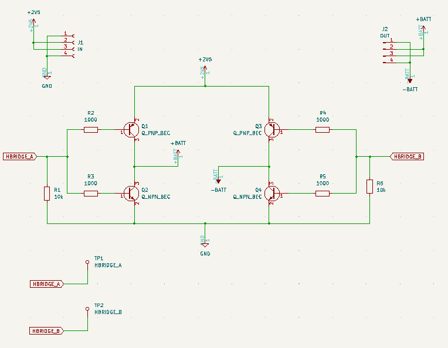

# VFD h-bridge circuit

This is a bodge board for the first version of the IVL2-7/5 clock. (That revision will not be released
because it has bugs.)

Individual VFD tubes can be driven off DC without issue, but the multiplexed panels must be driven
with AC or else you will get ghosting artifacts.

This is a standard h-bridge driver design. `rp2040hbridgedriver.py` drives the inputs for you.

When picking your transistors, you need to make sure the gain (hFE) values are high enough, or else the transistors
will limit the current to the filament, which will drop the voltage below an acceptable level and probably
cause damage to the display. The boards I assembled used MMBT3904 and MMBT3906 transistors, which worked based
on pure luck. I was not so lucky when I tried this circuit with other transistors and other tubes...

## The schematic

Really boring...

