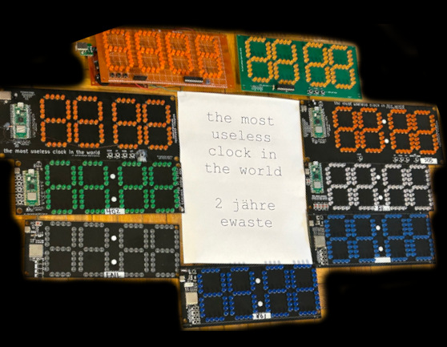

# The Most Useless Clock in the World

**[End-user documentation over here!](https://github.com/wurthless-elektroniks/clock/tree/main/docs)**

This is The Most Useless Clock in the World. It tells time, and nothing else. But it is very stylish and can easily be seen across a room.

This project started with LEDs as the target display technology but has been expanded to cover Soviet Nixie and VFD tubes and displays as well.

## Why the hell would you do something like this?

Building a clock, or some such basic-yet-useful device, is a typical beginners' electronics project which I would highly recommend to anyone looking to start out in the hobby. It teaches the following:

* Electronics
* Soldering, particularly for surface mount components
* Circuit design
* Embedded systems software development
* Cost-reduction techniques

So yeah, this is a dumb hobby project that I keep going back to because it's interesting. And it's a nice way to spend an evening: by cursing at surface-mounted electronic components.

## Why Micropython?

I've been asked this question a couple of times.

The answer is "ease of development". Specifically, I can target a ton of architectures this way with little code changes
and not have to deal with that platform's toolchains and debuggers. The drawback is that some controllers really get pushed
to the limits trying to run the software.

TMUCITW v8 is an ESP32-based board and it really shows the limitations of having to write everything in Micropython. The
board was designed to be as cheap as possible, so the ESP32 has to do display multiplexing all on its own. There's also
major memory limitations on ESP32, which is why everything has to be built as .mpy files - the software chokes otherwise.

## Technical support, manual, etc.

See docs/ directory.

## License

BSD 3-clause
