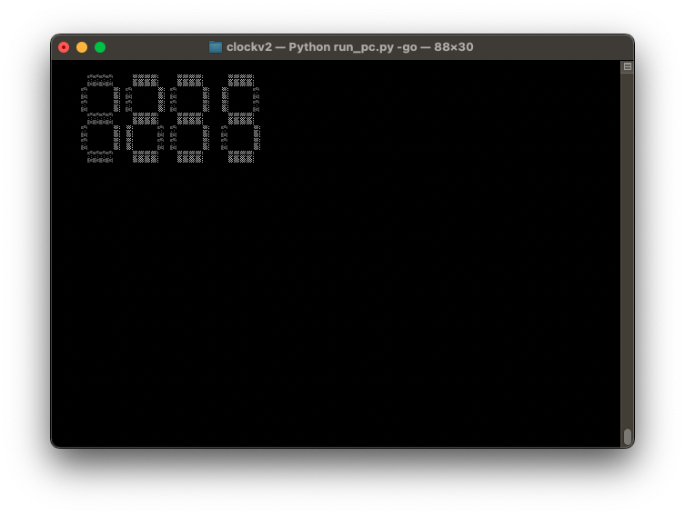

# The Most Useless Clock in the World

**[End-user documentation over here!](https://github.com/wurthless-elektroniks/clock/tree/main/docs)**

Python-based seven-segment digital clock. It is called "The Most Useless Clock in the World" because it is janky, overpriced, and tells the time and nothing else. But it is very stylish and can easily be seen across a room.

This is a rewrite of the [original TMUCITW software](https://github.com/wurthless-elektroniks/clock_v1), but aims to be much more portable and modular than the original, which only targeted ATMega328s that had a MAX7219 and DS1307. It also features the ability to synchronize time with a timesource, which is most often a NTP server accessed over Wi-Fi, but can be anything.

# Why the hell would you do something like this?

Building a clock, or some such basic-yet-useful device, is a typical beginners' electronics project which I would highly recommend to anyone looking to start out in the hobby. It teaches the following:

* Electronics
* Soldering, particularly for surface mount components
* Circuit design
* Embedded systems software development
* Cost-reduction techniques

So yeah, this is a dumb hobby project that I keep going back to because it's interesting. And it's a nice way to spend an evening: by cursing at surface-mounted electronic components.

# How to use

* For local testing on PC: python3 run_pc.py
* For deployment on RP2040-based hardware: copy relevant ini in defaults/ to secrets, rename factory.ini, and have your RP2040 board call the appropriate function in run_pico.py
* Early support for ESP32 present, check run_esp32.py. Note that since all this is bitbanged you won't be able to get a stable display.

# Technical support, manual, etc.

See docs/ directory.

# License

BSD 3-clause
